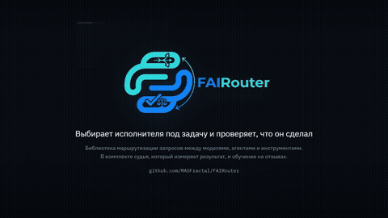

<div align="center">


### Выбирает исполнителя под задачу и проверяет, что он сделал

Библиотека маршрутизации запросов между моделями, агентами и инструментами. В комплекте идет судья,
который измеряет результат, и обучение на отзывах.

[](https://github.com/MASFractal/FAIRouter/stargazers)
[](https://github.com/MASFractal/FAIRouter/network/members)
[](https://github.com/MASFractal/FAIRouter/issues)
[](https://github.com/MASFractal/FAIRouter/commits)
[](LICENSE)
[](https://dotnet.microsoft.com/)



</div>

---

## Зачем это нужно

У вас десяток моделей и агентов. Цена различается в десятки раз, скорость в разы, а качество у
каждой модели свое: одна сильна в коде, другая в текстах. Слать все запросы в самую мощную модель
дорого, слать все в дешевую значит терять в качестве. Выбирать вручную под каждую задачу
невозможно.

Каталог OpenRouter показывает масштаб этого разброса: из 428 моделей цена выхода отличается в
двадцать тысяч раз (от 0,03 до 600 долларов за миллион токенов), зрение поддерживают 261 модель,
вызов инструментов 361.

FAIRouter выбирает исполнителя сам, а затем проверяет результат и учится на нем.

* **Не платить за лишнюю силу.** Метрика выбора сводит вместе прогноз качества, цену по прайсу
  исполнителя и ожидаемое время. Дешевая модель выигрывает там, где справится.
* **Знать, что получилось.** Судья сравнивает готовый ответ с тем, что заказывали, и показывает
  расхождения по каждому пункту. Например: заказано 4 раздела и таблица, получено 1 раздел и ноль
  таблиц.
* **Становиться точнее.** Отзывы копятся, веса обучаются, и кандидаты со временем расходятся по
  типам задач.

## Кейсы

**Агент или чат просит «любую подходящую модель».** OpenClaw, свой бот или сервис указывает
модель `auto`, а FAIRouter на каждый запрос выбирает исполнителя из ваших моделей: дешевого там,
где он справится, сильного там, где нужен. Подключение описано в разделе про OpenClaw ниже.

**Счет за модели растет быстрее пользы.** Роутер ведет журнал ходов с ценой и оценкой, а веса
метрики задают, сколько качества вы готовы отдать за экономию. Профиль «экономный» на проверке
дал качество выше стратегии «всегда самая дешевая» при почти той же цене и впятеро дешевле самой
дорогой модели.

**Нужно знать, выполнено ли задание, а не только получить текст.** Судья сравнивает готовый
ответ с распознанным заданием по шестнадцати пунктам и показывает, где именно расхождение:
заказано 4 раздела и таблица, получено 1 раздел без таблицы. Работает и отдельно от роутинга, как
приемка любого текста по его брифу.

**Свои модели на своих типах задач.** Стенд из `docs/research` замеряет качество каждой модели на
каждом вашем типе задач и превращает замер в начальные веса роутера: полезен с первого хода, а
дальше уточняется на отзывах.

## API

Весь контур собран в один объект. Python:

```python
from fai_router import FaiRouter

router = FaiRouter.from_openrouter(
    api_key="...",
    model_ids=["google/gemini-2.5-flash", "openai/gpt-4.1-mini", "anthropic/claude-haiku-4.5"],
    database_path="fai-router.db",
)

answer = router.ask("Напиши обзор методов кластеризации на 1500 знаков в научном стиле")
print(answer.winner, answer.score)   # кто ответил и оценка судьи
print(answer.critic)                 # расхождения с заданием по пунктам

router.feedback(answer.round_id, 1.0)   # отзыв человека, если есть
router.train(epochs=10)                 # обучение по журналу
router.save()
```

C#:

```csharp
Settings.LLM = new LLMWithOpenRouterClient(new LLMOptions { ApiKey = "...", ModelName = "openai/gpt-4o-mini" });

FaiRouter router = new(candidates, (candidate, prompt) => Ask(candidate.Name, prompt), "fai-router.db");

RouterAnswer answer = await router.AskAsync("Напиши обзор методов кластеризации на 1500 знаков");
Console.WriteLine($"{answer.Winner.Name}: {answer.Score}");
Console.WriteLine(answer.Critic);

router.Feedback(answer.RoundId!.Value, 1.0);
router.Train(epochs: 10);
router.Save();
```

Кандидатов в C# можно собрать из каталога через `ModelCatalog.CreateElement`, а ответы получать
любым способом: делегат исполнителя получает кандидата и запрос и возвращает текст. Все элементы
контура доступны и по отдельности, они описаны в [CSharp/README.md](CSharp/README.md) и
[Python/README.md](Python/README.md).

## Как проверить, что выбор оптимален

Здесь два разных вопроса, и путать их нельзя.

**Кто победил на конкретном запросе и почему.** `router.ask(...)` отдает только победителя, а
чтобы увидеть оценки всех кандидатов топ-K, нужен более низкий уровень, `Env.GetTopK`:

```python
features = InputFeaturesService.get_features_full(prompt)
for score, candidate in env.get_top_k(features, candidates):
    print(candidate.name, score)   # оценки по метрике R, лидер первым
```

```csharp
InputFeatures features = await InputFeaturesService.GetFeaturesAsync(prompt);
foreach (var (score, candidate) in Env.GetTopK(features, candidates))
    Console.WriteLine($"{candidate.Name} {score}");
```

**Действительно ли роутер выбирает лучше очевидных альтернатив.** Проверили на восьми задачах,
которых роутер не видел, против трех соперников: всегда самая дешевая модель, всегда самая дорогая
и идеальный выбор, то есть лучшая модель на каждой задаче, известная только задним числом.

* С профилем «качество прежде всего» роутер обходит по качеству всех соперников, включая обе
  фиксированные модели.
* С экономным профилем он дает качество выше, чем всегда дешевая модель, почти по той же цене, и не
  уступает по качеству всегда дорогой модели при цене впятеро ниже.
* Проще говоря, роутер закрывает всю шкалу от «дешевле» до «сильнее», а веса задают, где на ней
  стоять. Ни у одной фиксированной модели такого выбора нет.

Таблицы, точные числа и оговорки о размере выборки приведены в
[router-eval.md](docs/research/router-eval.md).

## Установка в OpenClaw

OpenClaw подключает поставщиков через настройки в `~/.openclaw/openclaw.json`, и FAIRouter встает
туда как еще один поставщик с одной моделью `auto`. Нужен Python 3.11 и ключ OpenRouter.

Запустите сервер, перечислив модели, между которыми выбирать:

```bash
pip install -e Python
OPENROUTER_API_KEY=... python -m fai_router.server \
    --models google/gemini-2.5-flash,openai/gpt-4.1-mini,anthropic/claude-haiku-4.5 \
    --db ~/.openclaw/fai-router.db --port 8412
```

Сервер отвечает по протоколу OpenAI chat completions на `http://127.0.0.1:8412/v1`. Добавьте его
в `~/.openclaw/openclaw.json`:

```json5
{
  agents: {
    defaults: {
      model: { primary: "fai/auto" },
    },
  },
  models: {
    providers: {
      fai: {
        baseUrl: "http://127.0.0.1:8412/v1",
        apiKey: "not-needed",
        api: "openai-completions",
        timeoutSeconds: 300,
        models: [{ id: "auto", name: "FAIRouter", contextWindow: 128000, maxTokens: 8192 }],
      },
    },
  },
}
```

Затем:

```bash
openclaw models set fai/auto
openclaw gateway restart
```

Каждый запрос OpenClaw пройдет через роутер: задание распознается по последнему сообщению
пользователя, исполнителю уходит весь диалог, ответ возвращается в формате OpenAI, а в поле
`fai_router` ответа лежат номер хода, оценка судьи и признак разведки. Замер ответов судьей стоит
одного обращения к модели на ход; его отключает `--no-measure`. Отзывы и обучение делаются
через журнал в указанной базе.

## Как это работает

Устройство образуют два контура, они же две петли на логотипе. Величина «качество» живет здесь в
двух видах, а разница между ними служит сигналом обучения.

<div align="center">


</div>

Роутер предсказывает качество до того, как задача исполнена, опираясь только на текст запроса.
Судья измеряет качество после. Следовательно, расхождение прогноза с фактом учит роутера, а
расхождение судьи с оценкой человека учит судью.

## Быстрый старт

Раздел «API» выше показывает короткий путь через фасад `FaiRouter`. Здесь тот же ход собран из
отдельных частей вручную, чтобы было видно устройство изнутри: признаки задачи, соревнование
кандидатов, замер ответа, критик.

```csharp
// Модель для распознавания задачи, одна на процесс
Settings.LLM = new LLMWithOpenRouterClient(new LLMOptions
{
    ApiKey = "...",
    ModelName = "openai/gpt-4o-mini"
});

// Кандидаты: цена за миллион токенов и скорость
BaseRoutedElement[] candidates =
[
    new() { Name = "Gemini 2.5 Flash", TPS = 200, DPMTInp = 0.3, DPMTOutp = 2.5 },
    new() { Name = "Sonnet 4.6",       TPS = 60,  DPMTInp = 3,   DPMTOutp = 15 },
    new() { Name = "Opus 4.6",         TPS = 20,  DPMTInp = 15,  DPMTOutp = 75 }
];

// Ход роутинга целиком
Tracert trace = await Env.RouteAsync("Напиши обзор на 4000 знаков в научном стиле", candidates);
Console.WriteLine(trace.Winner.Name);

// Победитель ответил, теперь измеряем и разбираем
Specifications actual = await new SpecOutputService().GetSpecificationsAsync(answer);
Console.WriteLine(Judge.Criticize(trace.RequestedSpec!, actual));
```

То же самое на Python:

```python
Settings.llm = OpenRouterClient(api_key="...", model="openai/gpt-4o-mini")

candidates = [
    RoutedElement("Gemini 2.5 Flash", tps=200, dpmt_inp=0.3, dpmt_outp=2.5),
    RoutedElement("Sonnet 4.6",       tps=60,  dpmt_inp=3,   dpmt_outp=15),
    RoutedElement("Opus 4.6",         tps=20,  dpmt_inp=15,  dpmt_outp=75),
]

trace = env.route("Напиши обзор на 4000 знаков в научном стиле", candidates)
print(trace.winner.name)

actual = SpecOutputService().get_specifications(answer)
print(Judge.criticize(trace.requested_spec, actual))
```

Вот как выглядит отчет критика на реальном прогоне:

```
Стиль: заказано Scientific, получено Conversational
Таблицы: заказано 1, получено 0
Ссылки на источники: заказано True, получено False
Объем в символах: заказано 4000, получено 243
Разделы: заказано 4, получено 1
...
Провалено пунктов 12 из 16
```

## Что внутри

| Возможность | Как устроено |
|---|---|
| **Выбор исполнителя** | метрика R сводит прогноз качества, цену и время, а веса обмена настраиваются |
| **Разбор задания** | требования извлекаются из текста запроса одним обращением к модели, по строгой схеме |
| **Замер результата** | структуру считает арифметика (объем, разделы, таблицы, код, формулы, читаемость), стиль и лексику распознает модель |
| **Критик** | построчный разбор расхождений между заказом и фактом, понятный человеку |
| **Обучение** | судья спуском по градиенту повторяет оценку человека, кандидаты разводятся контрастивно |
| **Каталог моделей** | цены, размеры окна и возможности берутся у поставщика, руками задается только скорость |
| **Отсев по возможностям** | неспособный кандидат отсеивается до сравнения оценок, а не выигрывает по цене |
| **Запасной вариант** | отказал победитель, ход переходит следующему из топ-K, и похвалу получает сделавший работу |
| **Память** | веса, ходы и отзывы в одном файле SQLite, причем отзыв дописывается позже хода |

Смысл распознает языковая модель, структуру считает арифметика. Маршрутизации поиском подстрок в
запросе нет нигде: исполнитель выбирается по признакам задачи, а не по совпадению слов.

## Измерения

Каждое решение в проекте опирается на измерение, а не на предположение. Данные и методика собраны в
[docs/research](docs/research).

Первый вопрос звучал так: какую модель ставить судьей? Семь моделей проверили на текстах с заранее
известным стилем.

| Модель | Стиль | Термины | Извлечение ТЗ | Время |
|---|---|---|---|---|
| `openai/gpt-4o-mini` | **5/5** | **1,00** | 6/6 | 8,2 с |
| `anthropic/claude-haiku-4.5` | **5/5** | 0,90 | 6/6 | 14,0 с |
| `google/gemini-2.5-flash` | 4/5 | 0,90 | 6/6 | **5,9 с** |
| `anthropic/claude-sonnet-4.5` | 4/5 | 0,90 | 6/6 | 18,5 с |
| `deepseek/deepseek-chat` | 3/5 | 0,90 | 6/6 | 11,7 с |

Эти цифры показывают, что извлечение требований удается всем моделям одинаково: точность здесь
обеспечивает строгая схема ответа, а не сообразительность модели. Отсюда следует, что дорогая
модель судьей не лучше: `sonnet-4.5` разобрал стиль хуже, чем `gpt-4o-mini`, и потратил вдвое
больше времени. Подробности приведены в [judge-models.md](docs/research/judge-models.md).

Каждое измерение находило ошибку, которую не ловила ни сборка, ни чтение кода. Судья
[измерял только длину текста](docs/research/feature-scaling.md), шкала терминологии не работала
вовсе, а одна из моделей возвращала значение за пределами объявленного диапазона.

## Сборка

Библиотека реализована на двух языках независимо, с одинаковым устройством и одинаковой метрикой.
Выбор между ними определяется только тем, на чем написан остальной проект.

### C#

Понадобится .NET 10 и репозиторий `AIFramework3Open`, который должен лежать рядом с `FAIRouter`,
поскольку ссылки на него относительные.

```bash
dotnet build CSharp/src/FAI.Router/FAI.Router.csproj
```

| Зависимость | Зачем |
|---|---|
| `AI` | `Vector`, `Matrix` |
| `AI.LLM` | клиент OpenRouter и структурированный ответ |
| `AI.NLP` | разбиение на предложения с учетом русских сокращений |
| `AI.NeuralNetworks` | автоматическое дифференцирование и оптимизаторы для обучения весов |
| `Microsoft.Data.Sqlite` | хранилище весов и накопленных ходов |

Подробности сборки и устройство кода описаны в [CSharp/README.md](CSharp/README.md).

### Python

Нужен Python 3.11 и выше, внешних зависимостей всего одна: `numpy`. Обращения к OpenRouter идут
через встроенный `urllib`, база через встроенный `sqlite3`, никаких дополнительных пакетов ставить
не нужно.

```bash
pip install -e Python
```

Градиенты для обучения выведены аналитически на numpy, без автоматического дифференцирования: в C#
для этого рядом лежит `AIFramework3Open`, в Python такой зависимости нет и градиенты умещаются в
несколько строк на каждый тренер. Подробности сборки и устройство кода описаны в
[Python/README.md](Python/README.md).

## Устройство

<details>
<summary><b>Метрика выбора R</b></summary>

```
R = WQ·q − WC·c − Wt·t
```

Здесь `q` означает прогноз качества, то есть скалярное произведение признаков задачи на обучаемый
вектор кандидата («на каких задачах я хорош»). Величина `c` задает логарифм стоимости запроса по
ценам исполнителя, а `t` логарифм ожидаемого времени. Каждое слагаемое приводится к нулевому
среднему и единичному разбросу внутри группы кандидатов, поэтому веса `WQ`, `WC` и `Wt` в
`Settings` сравнивают сравнимое и означают доли важности: по умолчанию половина решения за
качеством, по четверти за ценой и временем.

Без приведения к одному масштабу цена в решении не участвовала вовсе: в долларах за запрос она
имеет порядок 0,0002, и ее вклад был в 1156 раз меньше вклада качества. Измерение приведено в
[live-session.md](docs/research/live-session.md), а действие исправления в
[router-eval.md](docs/research/router-eval.md).

</details>

<details>
<summary><b>Спецификация как общий язык заказа и факта</b></summary>

Тип `Specifications` описывает и требования к ответу, и свойства готового текста. Один тип на обе
стороны нужен для того, чтобы их можно было сравнить. Стиль участвует в векторе кодом «один из
многих».

Координаты приведены к соизмеримым масштабам: объемы и счетчики по логарифмической шкале,
читаемость делением на 100, доли от нуля до единицы остаются как есть. Без этого объем в символах
давал 97,8 процента длины вектора, и судья не отличал научный текст от детского. Числа приведены в
[отдельном документе](docs/research/feature-scaling.md).

Масштабы заданы константами в `Specifications`. Если добавили поле, добавьте и его масштаб.

</details>

<details>
<summary><b>Зачем судье обучаемая матрица</b></summary>

Заказ и факт не совпадают буквально даже при отличной работе исполнителя. Скажем, заказали 3000
знаков, а хороший ответ дал 2700. Матрица `TransformerW` и есть выучиваемое отображение «что
просили» в «как это выглядит, когда сделано хорошо». Единичная матрица на старте означает наивное
допущение, будто факт обязан совпасть с заказом.

Обучается она на оценках человека, а ошибкой служит квадрат расхождения между оценкой судьи и
ответом «нравится или нет».

</details>

<details>
<summary><b>Раскладка каталогов</b></summary>

| Каталог | Что внутри |
|---|---|
| `RoutedElements` | кандидат на исполнение: цены, скорость, обучаемый вектор соответствия |
| `JudgeLogic` | `Judge`, `Specifications`, `DiffSpec` для оценки и критики результата |
| `Services` | извлечение ТЗ, замер факта, текстовые метрики |
| `LLM` | обращения к модели: разбор запроса, распознавание стиля и лексики |
| `RotationTracking` | признаки хода, трассировка, отзыв |
| `Training` | обучение судьи и роутера, мост к тензорам |
| `Persistence` | веса и накопленные ходы в SQLite |
| `Env`, `Settings` | среда соревнования кандидатов и общие настройки |

Пространство имен совпадает с каталогом.

</details>

## Состояние

Работают полный ход роутинга, извлечение ТЗ, замер факта, критик, обучение обеих обучаемых величин,
холодный старт по заранее замеренному качеству, отсев по возможностям, запасной вариант при отказе
и хранилище весов с журналом ходов и отзывов. Контур проверен на живых задачах и настоящих моделях,
в том числе на восьми задачах, которых роутер не видел заранее.

Каждое улучшение в этом проекте подкреплено измерением, а не только логикой: числа, методика и
честные ограничения собраны в [docs/research](docs/research).

---

<div align="center">

Apache 2.0 · часть экосистемы FAI

</div>
