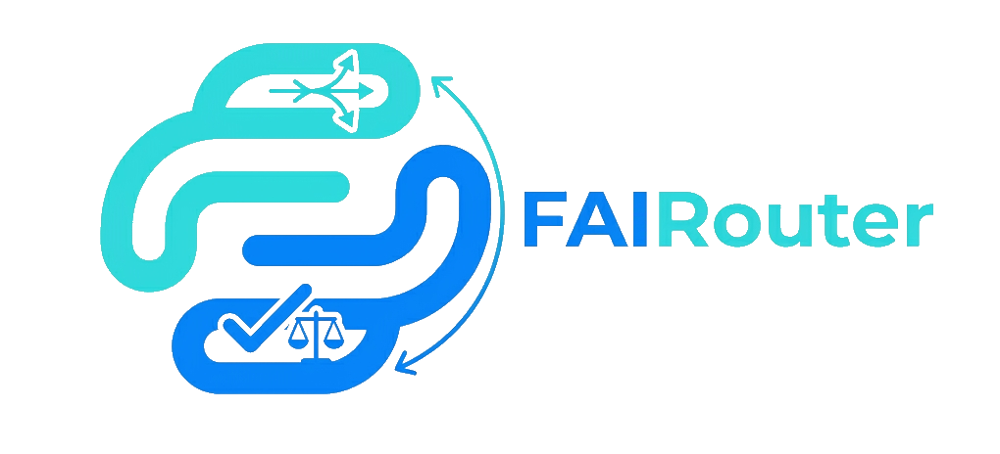
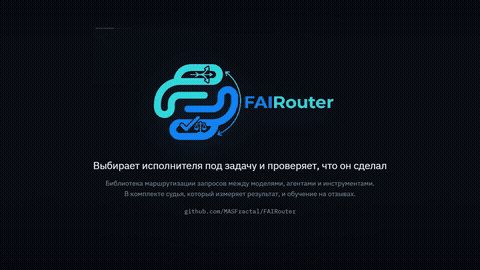
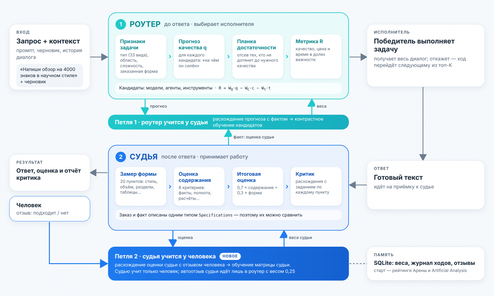

<div align="center">



### Выбирает исполнителя под задачу и проверяет, что он сделал

Библиотека маршрутизации запросов между моделями, агентами и инструментами. В комплекте идет судья,
который измеряет результат, и обучение на отзывах.

[](https://github.com/MASFractal/FAIRouter/stargazers)
[](https://github.com/MASFractal/FAIRouter/network/members)
[](https://github.com/MASFractal/FAIRouter/issues)
[](https://github.com/MASFractal/FAIRouter/commits)
[](LICENSE)
[](https://dotnet.microsoft.com/)



[](https://youtu.be/FMesl7rxbYo)
[](https://vkvideo.ru/video-233381656_456239019)

<br>

<table align="center">
<tr>
<td align="center" width="720">
<br>
<b>Увидеть в деле: MAS, многоагентная система FractalAgents</b>
<br><br>
Команда агентов разбирает задачу на шаги, выполняет их с инструментами и собирает результат.
Сервис той же команды, что и эта библиотека. Попробовать можно сразу в чате, без установки.
<br><br>
<a href="https://mas2.fractalagents.ai/"></a>&nbsp;
<a href="https://mas2.fractalagents.ai/chat/"></a>&nbsp;
<a href="https://fractalrouter.ru"></a>
<br><br>
</td>
</tr>
</table>

</div>

---

## Зачем это нужно

У вас десяток моделей и агентов. Цена различается в десятки раз, скорость в разы, а качество у
каждой модели свое: одна сильна в коде, другая в текстах. Слать все запросы в самую мощную модель
дорого, слать все в дешевую значит терять в качестве. Выбирать вручную под каждую задачу
невозможно.

Каталог OpenRouter показывает масштаб этого разброса: из 428 моделей цена выхода отличается в
двадцать тысяч раз (от 0,03 до 600 долларов за миллион токенов), зрение поддерживают 261 модель,
вызов инструментов 361.

FAIRouter выбирает исполнителя сам, а затем проверяет результат и учится на нем.

* **Качества хватает для дела.** Человеку важно не соотношение цены и качества, а хватит ли
  качества для его задачи: недостаточный ответ уводит его в другой сервис, и сэкономленное ничего
  не стоит. Поэтому роутер сначала отсеивает исполнителей, которые прогнозируемо не дотянут до
  нужной планки.
* **Не платить за лишнюю силу.** Среди тех, кто дотягивает до планки, решают цена по прайсу с
  поправкой на переделки и ожидаемое время. Дешевая модель выигрывает там, где справится.
* **Знать, что получилось.** Судья сравнивает готовый ответ с тем, что заказывали, и показывает
  расхождения по каждому пункту. Например: заказано 4 раздела и таблица, получено 1 раздел и ноль
  таблиц.
* **Становиться точнее.** Отзывы копятся, веса обучаются, и кандидаты со временем расходятся по
  типам задач.

## Кейсы

**Агент или чат просит «любую подходящую модель».** OpenClaw, свой бот или сервис указывает
модель `auto`, а FAIRouter на каждый запрос выбирает исполнителя из ваших моделей: дешевого там,
где он справится, сильного там, где нужен. Подключение описано в разделе про OpenClaw ниже.

**Счет за модели растет быстрее пользы.** Роутер ведет журнал ходов с ценой и оценкой, а веса
метрики задают, сколько качества вы готовы отдать за экономию. Профиль «экономный» на проверке
дал качество выше стратегии «всегда самая дешевая» при почти той же цене и впятеро дешевле самой
дорогой модели.

**Дешевый ответ, который не годится, обходится дороже всех.** Вызывающий задает планку: какую
вероятность того, что ответ устроит человека, выбор обязан обеспечить. Кто до нее не дотягивает, в
выбор не попадает, даже если он в разы дешевле. Если под выбранным потолком цены до планки не
дотягивает никто, роутер отдает сильнейшего и отмечает недобор, а вызывающий решает, поднять ли
уровень цены или предупредить человека.

**Нужно знать, выполнено ли задание, а не только получить текст.** Судья сравнивает готовый
ответ с распознанным заданием по двадцати пунктам и показывает, где именно расхождение:
заказано 4 раздела и таблица, получено 1 раздел без таблицы. Работает и отдельно от роутинга, как
приемка любого текста по его брифу.

**Свои модели на своих типах задач.** Стенд из `docs/research` замеряет качество каждой модели на
каждом вашем типе задач и превращает замер в начальные веса роутера: полезен с первого хода, а
дальше уточняется на отзывах.

## API

Весь контур собран в один объект. Python:

```python
from fai_router import FaiRouter

router = FaiRouter.from_fractalrouter(
    api_key="rtr_live_...",               # ключ FractalRouter, https://fractalrouter.ru
    model_ids=["google/gemini-2.5-flash", "openai/gpt-4.1-mini", "anthropic/claude-haiku-4.5"],
    database_path="fai-router.db",        # веса и журнал ходов; пустой файл на старте в порядке
)

answer = router.ask("Напиши обзор методов кластеризации на 1500 знаков в научном стиле")
print(answer.winner, answer.score)   # кто ответил и оценка судьи
print(answer.critic)                 # расхождения с заданием по пунктам

# Отзыв человека на ход: число от 0 до 1. Единица означает отличный ответ, ноль никуда
# не годный, 0.5 так себе. Отзыв перезаписывает автоматическую оценку судьи
router.feedback(answer.round_id, 1.0)   # ответ отличный
# router.feedback(answer.round_id, 0.2) # ответ плохой
router.train(epochs=10)                 # обучение по журналу ходов и отзывов
router.save()                           # веса в базу; до этого вызова таблицы весов пусты
```

Пакет ставится как любая библиотека, после этого файл с кодом может лежать где угодно:

```bash
pip install fai-router
```

Пока пакет не выложен на PyPI, та же команда ставит его прямо из репозитория:
`pip install "git+https://github.com/MASFractal/FAIRouter#subdirectory=Python"`. Если pip не может
скачать setuptools для сборки (индекс PyPI недоступен из сети), добавьте `--no-build-isolation`,
тогда сборка идет уже установленным setuptools. Без установки файл с кодом кладется в каталог
`Python` репозитория, рядом с пакетом `fai_router`.

Поставщики задаются фабриками: `FaiRouter.from_fractalrouter` для [FractalRouter](https://fractalrouter.ru),
`FaiRouter.from_openrouter` для OpenRouter и `FaiRouter.from_openai_compatible(base_url, ...)` для
любого сервера по протоколу OpenAI chat completions. FractalRouter это наш шлюз к четырем сотням
моделей с оплатой в рублях, он не связан с FractalGPT. Ответы кандидатов и работа модели-судьи
(`judge_model`, по умолчанию `openai/gpt-4o-mini`) идут через одного поставщика и один ключ. Цена
модели берется из каталога поставщика по ее идентификатору: у FractalRouter в рублях, у OpenRouter в
долларах, для выбора важны только отношения цен между кандидатами. Модели, которой в каталоге нет,
цену задает довод `prices={"имя": (вход, выход)}` за миллион токенов.

Пустая база на старте это норма: таблицы весов заполняются при `save()`, журнал при `ask()` и
`feedback()`. До первого обучения кандидаты стартуют с прогноза по снимку внешних замеров
в комплекте пакета (`fai_router/data/benchmark-snapshot.json`), поэтому выбор осмыслен с первого хода,
а отзывы его уточняют.

Обрыв соединения с поставщиком (`RemoteDisconnected`, таймаут, ответ 429 или 5xx) клиент повторяет
трижды с растущей паузой, после чего сообщает, какой поставщик и на какой модели не ответил. Если
обрыв повторяется и после повторов, поставщик недоступен из вашей сети: так ведет себя OpenRouter
из-за блокировок и прокси, и в этом случае выручает FractalRouter. Сбой судьи ход не роняет: ответ
исполнителя возвращается без оценки и пишется в журнал без автоотзыва.

C#:

```csharp
FaiRouter router = await FaiRouter.FromFractalRouterAsync(
    apiKey: "rtr_live_...",                                   // ключ FractalRouter
    modelIds: ["google/gemini-2.5-flash", "openai/gpt-4.1-mini", "anthropic/claude-haiku-4.5"],
    databasePath: "fai-router.db");

RouterAnswer answer = await router.AskAsync("Напиши обзор методов кластеризации на 1500 знаков");
Console.WriteLine($"{answer.Winner.Name}: {answer.Score}");
Console.WriteLine(answer.Critic);

router.Feedback(answer.RoundId!.Value, 1.0);    // отзыв от 0 (плохо) до 1 (отлично)
router.Train(epochs: 10);
router.Save();
```

Фабрики в C# те же, что в Python: `FromFractalRouterAsync`, `FromOpenRouterAsync` и
`FromOpenAiCompatibleAsync(baseUrl, ...)`. Свои кандидаты и свой исполнитель передаются в конструктор
`FaiRouter`, а клиент судьи задается через `Settings.LLM`, например
`new OpenAiCompatibleLlm(Providers.FractalRouter, "rtr_live_...", "openai/gpt-4o-mini")`.

Ход по диалогу из нескольких реплик устроен одинаково в обеих версиях: `router.ask_messages(messages)`
в Python и `router.AskAsync(messages)` в C#, где `messages` это реплики по порядку (`IEnumerable<LLMMessage>`
из `AI.LLM`). Задание распознается по последней реплике пользователя, а исполнителю уходит весь диалог,
поэтому модель видит историю разговора. Изображения роутер не разбирает: задача распознается по тексту,
а зрение у кандидата требуется явно, доводом `required: Capability.Vision`.

Кандидатов в C# можно собрать из каталога через `ModelCatalog.CreateElement`, а ответы получать
любым способом: делегат исполнителя получает кандидата и реплики диалога и возвращает текст. Все элементы
контура доступны и по отдельности, они описаны в [CSharp/README.md](CSharp/README.md) и
[Python/README.md](Python/README.md).

### Из каких моделей идет выбор

Если модели не названы, роутер выбирает среди популярных моделей из комплекта: это модели с внешними
рейтингами в снимке замеров и недорогие рабочие лошадки, всего 54. Список лежит в
[Python/fai_router/data/popular_models.json](Python/fai_router/data/popular_models.json), он же встроен в
сборку на C#. Вместо списка можно передать набор: `"popular"` (по умолчанию) или `"all"`, весь каталог
поставщика. Модели из набора, которых нет в каталоге поставщика, пропускаются; модель из явного списка,
которой нет ни в каталоге, ни в `prices`, это ошибка.

```python
router = FaiRouter.from_fractalrouter("rtr_live_...")                      # популярные из комплекта
router = FaiRouter.from_fractalrouter("rtr_live_...", "all")               # весь каталог поставщика
router = FaiRouter.from_fractalrouter("rtr_live_...", ["openai/gpt-4o-mini", "anthropic/claude-sonnet-5"])
```

Чтобы собрать свой список, скопируйте из таблицы ниже нужные идентификаторы. Цены даны по каталогу
OpenRouter на дату сборки списка, только для ориентира: при запуске роутер берет цены из каталога
своего поставщика.

<details>
<summary><b>Популярные модели из комплекта</b></summary>

| Модель | Цена за млн токенов, $ (вход / выход) | Откуда в списке |
|---|---|---|
| `anthropic/claude-fable-5` | 10 / 50 | в рейтингах |
| `anthropic/claude-fable-5.1` | 10 / 50 | в рейтингах |
| `anthropic/claude-haiku-4.5` | 1 / 5 | рабочая лошадка |
| `anthropic/claude-opus-4.1` | 15 / 75 | в рейтингах |
| `anthropic/claude-opus-4.5` | 5 / 25 | в рейтингах |
| `anthropic/claude-opus-4.6` | 5 / 25 | в рейтингах |
| `anthropic/claude-opus-4.7` | 5 / 25 | в рейтингах |
| `anthropic/claude-opus-4.8` | 5 / 25 | в рейтингах |
| `anthropic/claude-opus-5` | 5 / 25 | в рейтингах |
| `anthropic/claude-sonnet-4.5` | 3 / 15 | в рейтингах |
| `anthropic/claude-sonnet-4.6` | 3 / 15 | в рейтингах |
| `anthropic/claude-sonnet-5` | 2 / 10 | в рейтингах |
| `deepseek/deepseek-chat` | 0.257 / 1.029 | рабочая лошадка |
| `deepseek/deepseek-v4-flash` | 0.042 / 0.084 | рабочая лошадка |
| `deepseek/deepseek-v4-pro` | 0.209 / 0.418 | в рейтингах |
| `deepseek/deepseek-v4.1-flash` | 0.03 / 0.5 | рабочая лошадка |
| `google/gemini-2.5-flash` | 0.3 / 2.5 | рабочая лошадка |
| `google/gemini-2.5-pro` | 1.25 / 10 | в рейтингах |
| `google/gemini-3-flash-preview` | 0.5 / 3 | в рейтингах |
| `google/gemini-3.1-pro-preview` | 2 / 12 | в рейтингах |
| `google/gemini-3.5-flash` | 1.5 / 9 | в рейтингах |
| `google/gemini-3.5-flash-lite` | 0.3 / 2.5 | в рейтингах |
| `google/gemini-3.6-flash` | 0.75 / 3.75 | в рейтингах |
| `google/gemini-3.7-flash` | 0.75 / 3.75 | в рейтингах |
| `google/gemini-3.8-flash` | 0.75 / 3.75 | в рейтингах |
| `meta-llama/llama-3.3-70b-instruct` | 0.1 / 0.32 | рабочая лошадка |
| `meta/muse-spark-1.1` | 1.25 / 4.25 | в рейтингах |
| `meta/muse-spark-1.2` | 1.25 / 4.25 | в рейтингах |
| `meta/muse-spark-1.3` | 1.25 / 4.25 | в рейтингах |
| `moonshotai/kimi-k2.5` | 0.45 / 2.25 | в рейтингах |
| `moonshotai/kimi-k2.6` | 0.434 / 1.828 | в рейтингах |
| `moonshotai/kimi-k3` | 0.415 / 10 | в рейтингах |
| `openai/gpt-4.1-mini` | 0.4 / 1.6 | рабочая лошадка |
| `openai/gpt-4o-mini` | 0.15 / 0.6 | рабочая лошадка |
| `openai/gpt-5.1` | 1.25 / 10 | в рейтингах |
| `openai/gpt-5.4` | 2.5 / 15 | в рейтингах |
| `openai/gpt-5.5` | 5 / 30 | в рейтингах |
| `openai/gpt-5.6-luna` | 0.2 / 1.2 | в рейтингах |
| `openai/gpt-5.6-sol` | 2 / 10 | в рейтингах |
| `openai/gpt-5.6-terra` | 2 / 12 | в рейтингах |
| `openai/gpt-6-astra` | 10 / 50 | в рейтингах |
| `qwen/qwen3.7-max` | 1.475 / 4.425 | в рейтингах |
| `qwen/qwen3.7-plus` | 0.32 / 1.28 | в рейтингах |
| `qwen/qwen3.8-flash` | 0.15 / 0.47 | рабочая лошадка |
| `tencent/hy3` | 0.083 / 0.33 | в рейтингах |
| `x-ai/grok-4.20` | 1.25 / 2.5 | в рейтингах |
| `x-ai/grok-4.5` | 2 / 6 | в рейтингах |
| `x-ai/grok-4.6` | 2 / 6 | в рейтингах |
| `xiaomi/mimo-v2.5-pro` | 0.435 / 0.87 | в рейтингах |
| `z-ai/glm-5` | 0.6 / 1.92 | в рейтингах |
| `z-ai/glm-5.1` | 0.965 / 3.032 | в рейтингах |
| `z-ai/glm-5.2` | 0.14 / 3.99 | в рейтингах |
| `z-ai/glm-5.3` | 0.222 / 3.39 | в рейтингах |
| `z-ai/glm-5.3-flash` | 0.15 / 0.5 | в рейтингах |

</details>

### Профили весов: качество, баланс, цена

Метрика выбора `R = WQ·q − WC·c − Wt·t` взвешивает качество, цену и время, и три готовых профиля
задают, где на шкале от «дешевле» до «сильнее» работает роутер. Профиль передается при создании
роутера на все ходы или отдельному ходу; свои веса задаются через `RouteWeights`.

| Профиль | WQ / WC / Wt | Что дает по замеру [router-eval](docs/research/router-eval.md) |
|---|---|---|
| `quality` | 0,8 / 0,10 / 0,10 | обходит по качеству все стратегии, включая всегда самую дорогую модель |
| `balance` | 0,5 / 0,25 / 0,25 | веса по умолчанию: половина решения за качеством, по четверти за ценой и временем |
| `price` | 0,3 / 0,60 / 0,10 | качество выше, чем у всегда самой дешевой модели, почти по той же цене |

```python
router = FaiRouter.from_fractalrouter("rtr_live_...", weights="price")     # экономный профиль на все ходы
answer = router.ask("Напиши обзор на 1500 знаков", weights="quality")      # этот ход важнее, выбор по качеству
```

В C# то же самое: `weights: RouteWeights.Price` в фабрике и `RouteWeights.Quality` в `AskAsync`.

## Как проверить, что выбор оптимален

Здесь два разных вопроса, и путать их нельзя.

**Кто победил на конкретном запросе и почему.** `router.ask(...)` отдает только победителя, а
чтобы увидеть оценки всех кандидатов топ-K, нужен более низкий уровень, `Env.GetTopK`:

```python
features = InputFeaturesService.get_features_full(prompt)
for score, candidate in env.get_top_k(features, candidates):
    print(candidate.name, score)   # оценки по метрике R, лидер первым
```

```csharp
InputFeatures features = await InputFeaturesService.GetFeaturesAsync(prompt);
foreach (var (score, candidate) in Env.GetTopK(features, candidates))
    Console.WriteLine($"{candidate.Name} {score}");
```

**Действительно ли роутер выбирает лучше очевидных альтернатив.** Проверили на восьми задачах,
которых роутер не видел, против трех соперников: всегда самая дешевая модель, всегда самая дорогая
и идеальный выбор, то есть лучшая модель на каждой задаче, известная только задним числом.

* С профилем «качество прежде всего» роутер обходит по качеству всех соперников, включая обе
  фиксированные модели.
* С экономным профилем он дает качество выше, чем всегда дешевая модель, почти по той же цене, и не
  уступает по качеству всегда дорогой модели при цене впятеро ниже.
* Проще говоря, роутер закрывает всю шкалу от «дешевле» до «сильнее», а веса задают, где на ней
  стоять. Ни у одной фиксированной модели такого выбора нет.

Таблицы, точные числа и оговорки о размере выборки приведены в
[router-eval.md](docs/research/router-eval.md).

## Планка достаточности

Метрика R разменивает качество на цену без ограничений: 0,1 качества уходит за экономию, даже если
именно эти 0,1 отделяют «сойдет» от «не сойдет». Планка меняет правило выбора на «необходимо и
достаточно»: сначала дотянуть до нужного качества, а за лишнее не платить.

Прогноз качества q сам по себе относительный: он умеет сказать «этот лучше того», но не «этот
сойдет». Поэтому планке нужна калибровка, то есть перевод прогноза в вероятность лайка
`σ(A·q + B)`, подобранный по журналу пар «прогноз в момент выбора и оценка человека».

Через фасад планка задается одним числом, обязательной вероятностью лайка, а калибровку роутер
подбирает сам по журналу человеческих отзывов:

```python
router = FaiRouter.from_fractalrouter("rtr_live_...", database_path="fai-router.db", bar=0.7)
answer = router.ask("Составь отчет по таблице продаж за квартал")
if answer.reached is False:
    print("Под этой планкой никто не дотягивает: ответил сильнейший, стоит предупредить человека")
answer = router.ask("Черновик поста для соцсети", bar=0.5)   # этому ходу планка пониже
```

```csharp
FaiRouter router = await FaiRouter.FromFractalRouterAsync("rtr_live_...", databasePath: "fai-router.db", bar: 0.7);
RouterAnswer answer = await router.AskAsync("Составь отчет по таблице продаж за квартал");
if (answer.Reached == false)
    Console.WriteLine("Под этой планкой никто не дотягивает: ответил сильнейший");
```

Пока человеческих отзывов в журнале меньше трех (`min_ratings`), калибровать не на чем, и ход идет
по метрике R без планки: `answer.reached` равен `None`. С тремя и более отзывами планка включается,
и каждый следующий отзыв уточняет калибровку. Готовую планку со своей калибровкой можно передать
вместо числа: `bar=SufficiencyBar(...)` в Python и свойство `router.Bar` в C#. У сервера планка
задается доводом `--bar 0.7`, и в ответе приходит поле `fai_router.reached`.

Среди дотянувших до планки ход разыгрывается как обычно, по метрике R с температурой, поэтому
разведка новичков сохраняется. Если не дотянул никто, ход без жребия отдается сильнейшему по
вероятности достаточности.

Те же действия по частям, без фасада:

```python
from fai_router import SufficiencyBar, env
from fai_router.training import Calibration

calibration = Calibration.fit(pairs)                     # пары (прогноз, оценка от 0 до 1)
bar = SufficiencyBar(0.7, calibration, prior_rate=0.62)  # обязательная вероятность лайка

chosen = env.get_sufficient(features, candidates, bar, weights=weights)
if not chosen.reached:
    print("Под этим уровнем цены нужного качества не достичь")
winner = chosen.top[0][1]
```

```csharp
Calibration calibration = Calibration.Fit(pairs);
SufficiencyBar bar = new(0.7, calibration, PriorRate: 0.62);

SufficientTop chosen = Env.GetSufficient(features, candidates, bar, weights: weights);
if (!chosen.Reached)
    Console.WriteLine("Под этим уровнем цены нужного качества не достичь");
BaseRoutedElement winner = chosen.Top[0].Element;
```

Правило устроено так:

* Кандидат с малым опытом получает не свой прогноз, а долю лайков по всем ходам: калибровка
  подобрана на тех, кто уже побеждал, и незнакомому ее наклону верить рано. Вероятность считается
  как `(n·σ(A·q + B) + k·p̄) / (n + k)`, где `n` означает число оценок кандидата, `p̄` долю лайков,
  а `k` силу усадки (по умолчанию 5).
* Среди прошедших планку вес качества равен десятой доле суммы весов цены и времени. Качество им
  уже обеспечено, поэтому решают цена и время.
* Если не прошел никто, `Reached` ложно, а `Top` упорядочен по вероятности достаточности,
  сильнейший первым.
* Поправка `CostRatio` у кандидата умножает его ожидаемую цену. Это отношение фактической цены его
  ходов к прайсу, и растет оно, например, от переделок после отказа приемки. Цену по прайсу без
  поправки дает `GetListCost`: именно с ней сравнивается факт, иначе поправка считалась бы сама из
  себя.

Калибровка в версиях на C# и Python совпадает до девятого знака, это закреплено тестом на общих
данных.

## Установка в OpenClaw

OpenClaw подключает поставщиков через настройки в `~/.openclaw/openclaw.json`, и FAIRouter встает
туда как еще один поставщик с одной моделью `auto`. Нужен Python 3.10 и ключ FractalRouter либо OpenRouter.

Запустите сервер, перечислив модели, между которыми выбирать:

```bash
pip install fai-router
FRACTALROUTER_API_KEY=rtr_live_... fai-router \
    --models google/gemini-2.5-flash,openai/gpt-4.1-mini,anthropic/claude-haiku-4.5 \
    --db ~/.openclaw/fai-router.db --port 8412
```

Поставщика сервер опознает по виду ключа: `rtr_live_...` это FractalRouter, `sk-or-...` это OpenRouter;
ключ OpenRouter можно задать и переменной `OPENROUTER_API_KEY`. Довод `--provider` задает поставщика
явно, для другого совместимого сервера укажите `--base-url https://host/v1`. Цену
модели, которой нет в каталоге поставщика, задает довод `--price имя=вход:выход` за миллион токенов.

Сервер отвечает по протоколу OpenAI chat completions на `http://127.0.0.1:8412/v1`. Добавьте его
в `~/.openclaw/openclaw.json`:

```json5
{
  agents: {
    defaults: {
      model: { primary: "fai/auto" },
    },
  },
  models: {
    providers: {
      fai: {
        baseUrl: "http://127.0.0.1:8412/v1",
        apiKey: "not-needed",
        api: "openai-completions",
        timeoutSeconds: 300,
        models: [{ id: "auto", name: "FAIRouter", contextWindow: 128000, maxTokens: 8192 }],
      },
    },
  },
}
```

Затем:

```bash
openclaw models set fai/auto
openclaw gateway restart
```

Каждый запрос OpenClaw пройдет через роутер: задание распознается по последнему сообщению
пользователя, исполнителю уходит весь диалог, ответ возвращается в формате OpenAI, а в поле
`fai_router` ответа лежат номер хода, оценка судьи и признак разведки. Замер ответов судьей стоит
одного обращения к модели на ход; его отключает `--no-measure`. Отзывы и обучение делаются
через журнал в указанной базе.

## Как это работает

Устройство образуют два контура, они же две петли на логотипе. Величина «качество» живет здесь в
двух видах, а разница между ними служит сигналом обучения.

<div align="center">



</div>

Роутер предсказывает качество до того, как задача исполнена, опираясь только на текст запроса.
Судья измеряет качество после. Следовательно, расхождение прогноза с фактом учит роутера, а
расхождение судьи с оценкой человека учит судью.

## Быстрый старт

Раздел «API» выше показывает короткий путь через фасад `FaiRouter`. Здесь тот же ход собран из
отдельных частей вручную, чтобы было видно устройство изнутри: признаки задачи, соревнование
кандидатов, замер ответа, критик.

```csharp
// Модель для распознавания задачи, одна на процесс
Settings.LLM = new LLMWithOpenRouterClient(new LLMOptions
{
    ApiKey = "...",
    ModelName = "openai/gpt-4o-mini"
});

// Кандидаты: цена за миллион токенов и скорость
BaseRoutedElement[] candidates =
[
    new() { Name = "Gemini 2.5 Flash", TPS = 200, DPMTInp = 0.3, DPMTOutp = 2.5 },
    new() { Name = "Sonnet 4.6",       TPS = 60,  DPMTInp = 3,   DPMTOutp = 15 },
    new() { Name = "Opus 4.6",         TPS = 20,  DPMTInp = 15,  DPMTOutp = 75 }
];

// Ход роутинга целиком
Tracert trace = await Env.RouteAsync("Напиши обзор на 4000 знаков в научном стиле", candidates);
Console.WriteLine(trace.Winner.Name);

// Победитель ответил, теперь измеряем и разбираем
Specifications actual = await new SpecOutputService().GetSpecificationsAsync(answer);
Console.WriteLine(Judge.Criticize(trace.RequestedSpec!, actual));
```

То же самое на Python:

```python
Settings.llm = OpenRouterClient(api_key="...", model="openai/gpt-4o-mini")

candidates = [
    RoutedElement("Gemini 2.5 Flash", tps=200, dpmt_inp=0.3, dpmt_outp=2.5),
    RoutedElement("Sonnet 4.6",       tps=60,  dpmt_inp=3,   dpmt_outp=15),
    RoutedElement("Opus 4.6",         tps=20,  dpmt_inp=15,  dpmt_outp=75),
]

trace = env.route("Напиши обзор на 4000 знаков в научном стиле", candidates)
print(trace.winner.name)

actual = SpecOutputService().get_specifications(answer)
print(Judge.criticize(trace.requested_spec, actual))
```

Вот как выглядит отчет критика на реальном прогоне:

```
Стиль: заказано Scientific, получено Conversational
Таблицы: заказано 1, получено 0
Ссылки на источники: заказано True, получено False
Объем в символах: заказано 4000, получено 243
Разделы: заказано 4, получено 1
...
Провалено пунктов 12 из 20
```

## Что оценивается

Оценок три группы. Признаки задачи известны до ответа, по ним роутер выбирает исполнителя.
Содержание и форма измеряются после ответа, итоговая оценка берет 0,7 содержания и 0,3 формы, и на
ней роутер учится. Таксономия признаков взята у внешних замеров: парные предпочтения людей на задачах дают
текстовые категории, прогоны бенчмарков дают отраслевые индексы и бизнес-функции агентной
работы. Те же замеры дают начальное качество кандидатов.

**Признаки задачи**

| Группа | Признаки | Откуда |
|---|---|---|
| Тип задачи | 33 вида в 8 группах: письма и коммуникации, отчеты и аналитика, маркетинг и продажи, документы и право, код и ИТ, наука и обучение, творчество и медиа, консультации и планы | бизнес-задачи пользователей, каждый вид сопоставлен серии замеров предпочтений или индексу бенчмарков |
| Область | 15 областей: 8 отраслевых категорий замеров предпочтений, маркетинг, финансы, продажи, кадры, поддержка, операции, инженерия | предпочтения, бизнес-функции агентной работы, отраслевые индексы |
| Предмет | язык программирования, область науки, язык ответа | предпочтения, знание языков программирования в бенчмарках |
| Сложность | трудность (7 признаков трудного запроса), экспертность, число явных ограничений, длина диалога, опора на факты | серии предпочтений на таких запросах |
| Заказанная форма | стиль, объем, разделы, списки, таблицы, код, формулы, глубина заголовков, читаемость, терминология, формальность, ссылки | библиотека |

**Содержание: восемь критериев судьи**

| Критерий | Что проверяет |
|---|---|
| Фактология | атомарные проверяемые утверждения ответа и вероятность истинности каждого, как в замере фактологии |
| Полнота по сути | раскрыт ли каждый смысловой пункт заказа, а не число разделов |
| Выполнение указаний | доля выполненных явных ограничений заказа |
| Верность рассуждений и расчетов | выводы следуют из данных, числа сходятся |
| Экспертная глубина | уровень, которого ждет специалист области |
| Наполнение структуры | таблицы и списки содержательны, без пустых и выдуманных строк |
| Качество источников | источники существуют, относятся к делу и подтверждают утверждения |
| Пригодность для дела | можно ли отдать результат заказчику как есть |

**Форма**: 20 пунктов, от стиля и объема до языка программирования и типа задачи.

**Критик** (`DiffSpec`) сводит в один построчный разбор все расхождения ответа с ТЗ, по обеим
осям: 20 пунктов формы, каждый смысловой пункт заказа (раскрыт, раскрыт частично, не раскрыт),
каждое явное ограничение (соблюдено или нарушено), экспертность ответа против заказанной, каждое
проверяемое утверждение с вероятностью истинности, расчеты, наполнение структуры, источники и
пригодность для дела. Не сверяются только трудность и длина диалога: это свойства запроса, у
ответа им нечего противопоставить.

```
Содержание 0.26, форма 1.00, итог 0.48
Смысловой пункт «вывод о рентабельности»: заказано раскрыть, получено не раскрыт
Качество источников: заказано 1, получено 0
Факт «Рентабельность выросла на 40%»: заказано верно, получено верно с вероятностью 0.10
Наполнение структуры: заказано 1, получено 0.1
Пригодность для дела: заказано 1, получено 0.1
Факт «Тариф Базовый стоит 990 рублей»: заказано верно, получено верно с вероятностью 0.20
Верность рассуждений и расчетов: заказано 1, получено 0.2
Экспертность: заказано 0.8, получено 0.3
Смысловой пункт «сравнить три тарифа по цене»: заказано раскрыть, получено раскрыт частично
- в таблице выдуманные цены
- вывода о рентабельности нет
```

Пример воспроизводит тест `test_critic_names_every_deviation_from_the_order`: структура совпала с
заказом полностью, а разбор все равно называет девять расхождений по содержанию.

Зачем две оси, видно на контрольной паре из проверочного набора. Задача: сравнить три тарифа
таблицей и выбрать выгодный для компании из 40 человек. Оба ответа одной формы, во втором
цифры в таблице выдуманы, а вывод не следует из данных:

| Ответ | Форма | Содержание | Итог |
|---|---|---|---|
| верный | 0,73 | 0,93 | 0,87 |
| с выдуманными цифрами | 0,72 | 0,40 | 0,49 |

Сверка формы разницы почти не видит. Судья содержания пишет: «для 40 сотрудников при лимите 10
нужно 4 подписки, то есть 4×990=3 960 руб., а не 1 980 руб.» Замеры на 66 бизнес-задачах и живой
прогон на четырех моделях собраны в [business-evaluation.md](docs/research/business-evaluation.md).

## Что внутри

| Возможность | Как устроено |
|---|---|
| **Выбор исполнителя** | метрика R сводит прогноз качества, цену и время; веса задаются на каждый выбор, и одновременные выборы с разными предпочтениями друг другу не мешают |
| **Планка достаточности** | кто прогнозируемо не дотягивает до нужной вероятности лайка, в выбор не попадает, а среди остальных решают цена и время |
| **Калибровка прогноза** | прогноз качества переводится в вероятность лайка по журналу оценок, малоизученный кандидат стягивается к средней доле лайков |
| **Поправка цены** | ожидаемая цена кандидата умножается на отношение фактической цены его ходов к прайсу |
| **Разбор задания** | требования извлекаются из текста запроса одним обращением к модели, по строгой схеме |
| **Признаки задачи** | область и бизнес-функция, тип бизнес-задачи (33 вида: письмо, отчет, коммерческое предложение, лендинг и другие), язык программирования, область науки, язык ответа, трудность, экспертность, число ограничений, опора на факты и длина диалога: вся таксономия внешних замеров входит в вектор, и роутер учится, кто в чем силен |
| **Замер результата** | структуру считает арифметика (объем, разделы, таблицы, код, формулы, читаемость), стиль и лексику распознает модель |
| **Оценка содержания** | судья по восьми критериям: фактология по проверяемым утверждениям, полнота по смысловым пунктам заказа, выполнение указаний, верность расчетов, экспертная глубина, наполнение таблиц и списков, качество источников, пригодность для дела |
| **Сверка формы** | построчный разбор расхождений между заказом и фактом по 20 пунктам, понятный человеку; в итоговой оценке весит 0,3, содержание 0,7 |
| **Обучение** | судья спуском по градиенту повторяет оценку человека, кандидаты разводятся контрастивно |
| **Каталог моделей** | цены, размеры окна и возможности берутся у поставщика, руками задается только скорость |
| **Старт с рейтингов** | 34 серии парных предпочтений и 118 серий прогонов бенчмарков (отраслевые индексы, фактология по областям, бизнес-функции, языки программирования) становятся начальными весами кандидата; оттуда же начальная скорость и поправка цены на рассуждения |
| **Отсев по возможностям** | неспособный кандидат отсеивается до сравнения оценок, а не выигрывает по цене |
| **Запасной вариант** | отказал победитель, ход переходит следующему из топ-K, и похвалу получает сделавший работу |
| **Память** | веса, ходы и отзывы в одном файле SQLite, причем отзыв дописывается позже хода |

Смысл распознает языковая модель, структуру считает арифметика. Маршрутизации поиском подстрок в
запросе нет нигде: исполнитель выбирается по признакам задачи, а не по совпадению слов.

## Измерения

Каждое решение в проекте опирается на измерение, а не на предположение. Данные и методика собраны в
[docs/research](docs/research).

Первый вопрос звучал так: какую модель ставить судьей? Семь моделей проверили на текстах с заранее
известным стилем.

| Модель | Стиль | Термины | Извлечение ТЗ | Время |
|---|---|---|---|---|
| `openai/gpt-4o-mini` | **5/5** | **1,00** | 6/6 | 8,2 с |
| `anthropic/claude-haiku-4.5` | **5/5** | 0,90 | 6/6 | 14,0 с |
| `google/gemini-2.5-flash` | 4/5 | 0,90 | 6/6 | **5,9 с** |
| `anthropic/claude-sonnet-4.5` | 4/5 | 0,90 | 6/6 | 18,5 с |
| `deepseek/deepseek-chat` | 3/5 | 0,90 | 6/6 | 11,7 с |

Эти цифры показывают, что извлечение требований удается всем моделям одинаково: точность здесь
обеспечивает строгая схема ответа, а не сообразительность модели. Отсюда следует, что дорогая
модель судьей не лучше: `sonnet-4.5` разобрал стиль хуже, чем `gpt-4o-mini`, и потратил вдвое
больше времени. Подробности приведены в [judge-models.md](docs/research/judge-models.md).

Каждое измерение находило ошибку, которую не ловила ни сборка, ни чтение кода. Судья
[измерял только длину текста](docs/research/feature-scaling.md), шкала терминологии не работала
вовсе, а одна из моделей возвращала значение за пределами объявленного диапазона.

## Сборка

Библиотека реализована на двух языках независимо, с одинаковым устройством и одинаковой метрикой.
Выбор между ними определяется только тем, на чем написан остальной проект.

### C#

Понадобится .NET 10 и репозиторий `AIFramework3Open`, который должен лежать рядом с `FAIRouter`,
поскольку ссылки на него относительные.

```bash
dotnet build CSharp/src/FAI.Router/FAI.Router.csproj
```

| Зависимость | Зачем |
|---|---|
| `AI` | `Vector`, `Matrix` |
| `AI.LLM` | клиент поставщика по протоколу OpenAI (FractalRouter, OpenRouter) и структурированный ответ |
| `AI.NLP` | разбиение на предложения с учетом русских сокращений |
| `AI.NeuralNetworks` | автоматическое дифференцирование и оптимизаторы для обучения весов |
| `Microsoft.Data.Sqlite` | хранилище весов и накопленных ходов |

Подробности сборки и устройство кода описаны в [CSharp/README.md](CSharp/README.md).

### Python

Нужен Python 3.10 и выше, внешних зависимостей всего одна: `numpy`. Обращения к поставщику идут
через встроенный `urllib`, база через встроенный `sqlite3`, никаких дополнительных пакетов ставить
не нужно. Пакет ставится как любая библиотека; до выкладки на PyPI его ставят из репозитория, а
режим правки нужен для разработки:

```bash
pip install fai-router
pip install "git+https://github.com/MASFractal/FAIRouter#subdirectory=Python"
pip install -e Python
```

Градиенты для обучения выведены аналитически на numpy, без автоматического дифференцирования: в C#
для этого рядом лежит `AIFramework3Open`, в Python такой зависимости нет и градиенты умещаются в
несколько строк на каждый тренер. Подробности сборки и устройство кода описаны в
[Python/README.md](Python/README.md).

## Устройство

<details>
<summary><b>Метрика выбора R</b></summary>

```
R = WQ·q − WC·c − Wt·t
```

Здесь `q` означает прогноз качества, то есть скалярное произведение признаков задачи на обучаемый
вектор кандидата («на каких задачах я хорош»). Величина `c` задает логарифм стоимости запроса по
ценам исполнителя с поправкой `CostRatio`, а `t` логарифм ожидаемого времени. Каждое слагаемое приводится к нулевому
среднему и единичному разбросу внутри группы кандидатов, поэтому веса `WQ`, `WC` и `Wt`
сравнивают сравнимое и означают доли важности. Веса передаются на каждый выбор (`RouteWeights`), а
`Settings` хранит значения по умолчанию: половина решения за качеством, по четверти за ценой и
временем.

Без приведения к одному масштабу цена в решении не участвовала вовсе: в долларах за запрос она
имеет порядок 0,0002, и ее вклад был в 1156 раз меньше вклада качества. Измерение приведено в
[live-session.md](docs/research/live-session.md), а действие исправления в
[router-eval.md](docs/research/router-eval.md).

</details>

<details>
<summary><b>Спецификация как общий язык заказа и факта</b></summary>

Тип `Specifications` описывает и требования к ответу, и свойства готового текста. Один тип на обе
стороны нужен для того, чтобы их можно было сравнить. Стиль участвует в векторе кодом «один из
многих». Так же входят предмет задачи (область, язык программирования, область науки, тип
рекламного текста), язык ответа и признак ссылок; у перечислений предмета значение «не задано»
разряда не имеет, поэтому задача без предмета выглядит так же, как до их появления.

Координаты приведены к соизмеримым масштабам: объемы и счетчики по логарифмической шкале,
читаемость делением на 100, доли от нуля до единицы остаются как есть. Без этого объем в символах
давал 97,8 процента длины вектора, и судья не отличал научный текст от детского. Числа приведены в
[отдельном документе](docs/research/feature-scaling.md).

Масштабы заданы константами в `Specifications`. Если добавили поле, добавьте и его масштаб.

</details>

<details>
<summary><b>Зачем судье обучаемая матрица</b></summary>

Заказ и факт не совпадают буквально даже при отличной работе исполнителя. Скажем, заказали 3000
знаков, а хороший ответ дал 2700. Матрица `TransformerW` и есть выучиваемое отображение «что
просили» в «как это выглядит, когда сделано хорошо». Единичная матрица на старте означает наивное
допущение, будто факт обязан совпасть с заказом.

Обучается она на оценках человека, а ошибкой служит квадрат расхождения между оценкой судьи и
ответом «нравится или нет».

</details>

<details>
<summary><b>Раскладка каталогов</b></summary>

| Каталог | Что внутри |
|---|---|
| `RoutedElements` | кандидат на исполнение: цены, скорость, обучаемый вектор соответствия |
| `JudgeLogic` | `Judge`, `Specifications`, `DiffSpec`, `ContentReview` для оценки формы и содержания |
| `Services` | извлечение ТЗ, замер факта, текстовые метрики |
| `LLM` | обращения к модели: разбор запроса, распознавание стиля и лексики, судья содержания |
| `Catalog` | каталог моделей OpenRouter и снимок внешних замеров: серии оценок, сопоставление имен |
| `RotationTracking` | признаки хода, трассировка, отзыв |
| `Training` | обучение судьи и роутера, калибровка прогноза, начальные веса из замера и из рейтингов, мост к тензорам |
| `Persistence` | веса и накопленные ходы в SQLite |
| `Env`, `Settings` | среда соревнования кандидатов и общие настройки |

Пространство имен совпадает с каталогом.

</details>

## Состояние

Работают полный ход роутинга, извлечение ТЗ, замер факта, критик, обучение обеих обучаемых величин,
холодный старт по заранее замеренному качеству и по внешним замерам, оценка содержания рядом со сверкой формы, отсев по возможностям, запасной вариант при отказе,
планка достаточности с калибровкой по отзывам, поправка цены на переделки и хранилище весов с
журналом ходов и отзывов. Контур проверен на живых задачах и настоящих моделях,
в том числе на восьми задачах, которых роутер не видел заранее.

Каждое улучшение в этом проекте подкреплено измерением, а не только логикой: числа, методика и
честные ограничения собраны в [docs/research](docs/research).

---

<div align="center">

Apache 2.0 · часть экосистемы FAI

</div>
